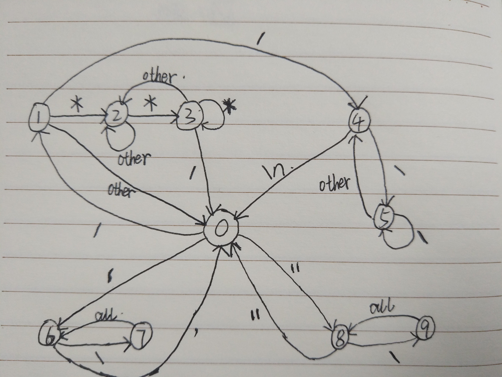

# Comment Insight
Sourcecode comments statistics clean tool, support language: C,CPP,C#,Python,Php,Java,Go

## 为什么写这个程序
前段时间在网络上找到一些旧的开源项目来学习研究。有的项目源码不仅开发环境比较旧（如VS2008...），源代码文件编码不统一（GB2312、GBK、UTF8...）,还有些乱七八糟的注释也比较影响代码阅读。

于是就有了这两个小需求：

-  批量把源代码文件编码转为UTF-8
-  快速清除注释（某些啰嗦的注释真的是很烦...）

在网上没找着合适的工具，那就自己撸一个吧。
一开始想着用Python+正则应该可以轻松搞定，后面发现正则处理不了某些复杂的字符块嵌套注释、换行问题，如在CSDN有网友在讨论的Demo:

~~~cpp
void test()
{
	//comment 1
	int i1 = 1;
	//comment 2 你好世界
	string inputString = "你好世界";

	/*sss333 ""*/
	int i2 =0; //comment 3 ""

	/*sss
	你好世界하이 월드""
	*/
	string s2="abcd";
	string url = "http://www.contoso.com"; // comment 4 
	string s = @"""multiline 
		 http://www.contoso.com
		 ///ssss
		 /*sss*/
		 ";//comment 5

	/*
	comment6*/ 
	string i3="こんにちは世界";
}
~~~

找了一下资料，看到用状态机来匹配查找注释字符，可以完美解决上述问题。

> | [怎样删除C/C++代码中的所有注释？浅谈状态机的编程思想]: https://www.cnblogs.com/zhanghaiba/p/3569928.html

	

在完成了C/C++的注释匹配状态机之后，又干脆把Python, Php, Go的状态机也加上了，毕竟都是大佬们喜欢的语言:)。

在写的过程中有了一个想法，干脆做一个注释行数统计功能吧，看看大佬们写的代码中注释占比多少。

结果发现注释占比10%~15%是比较常见的，就是说每1000行的代码中，100-200行的注释是比较OK的，毕竟注释太少不好懂，大多了就有点水了...

