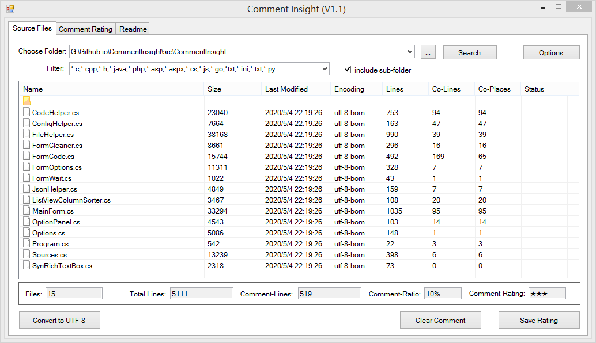
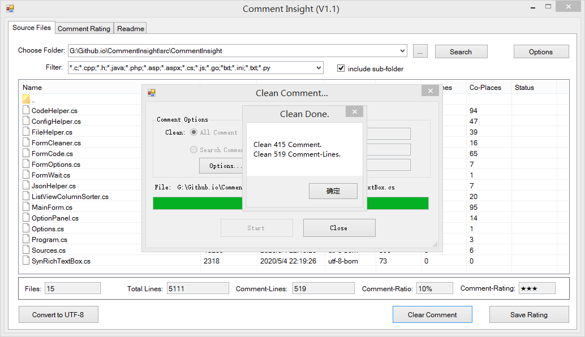
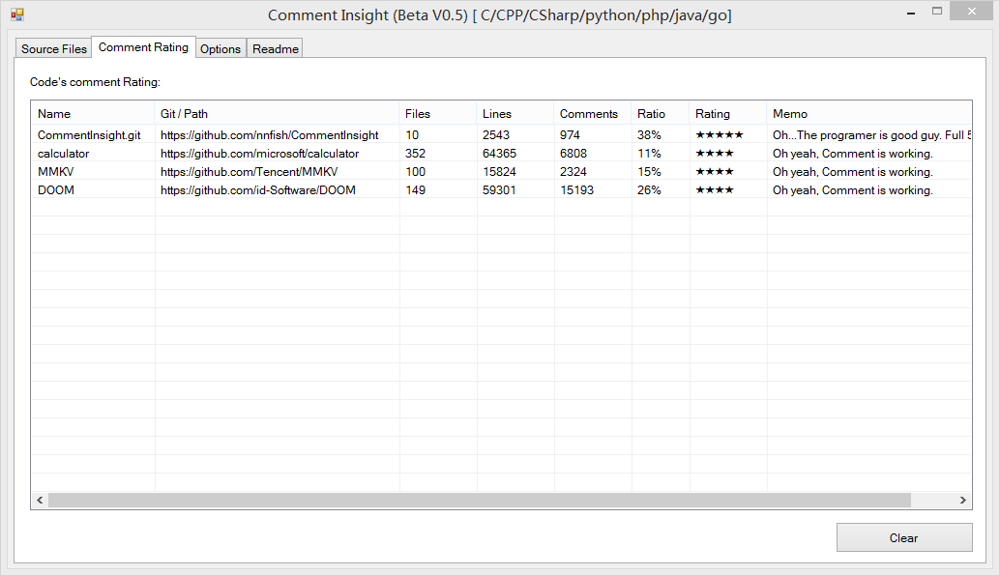
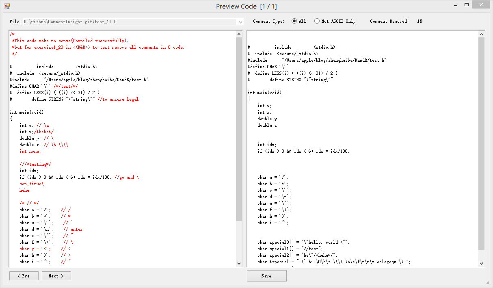
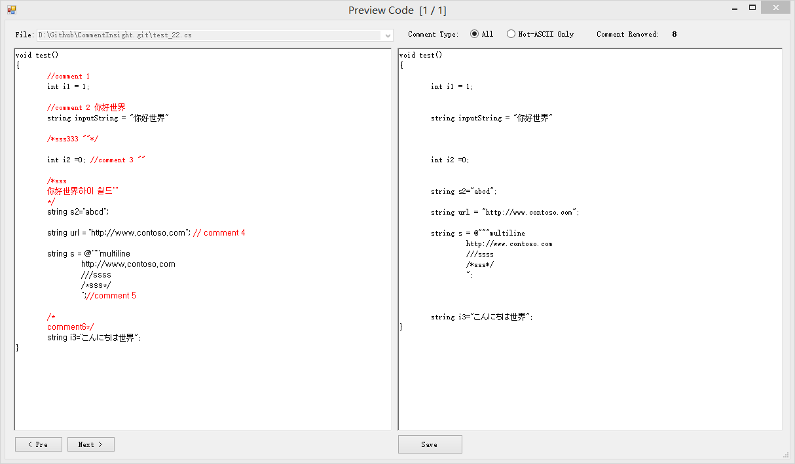

# Comment Insight
Sourcecode comments statistics clean tool, support language: C,CPP,C#,Python,Php,Java,Go

源代码注释统计&清理工具，支持编程语言C,CPP,C#,Python,Php,Java,Go

## Feature 功能
- Count comment lines in source files 分析&统计源代码中的注释
- Clean comments 清除注释
- Convert Source files encoding to UTF-8 转换源代码的文件编码

## FAQ 其它
- 运行环境 Windows 7,8,10+, .Net Freamework 4.5.2

- [为什么写了这个小程序](./FAQ.html)

## Youtube Demo

## Screenshot 截图

	
	
	
	
	
